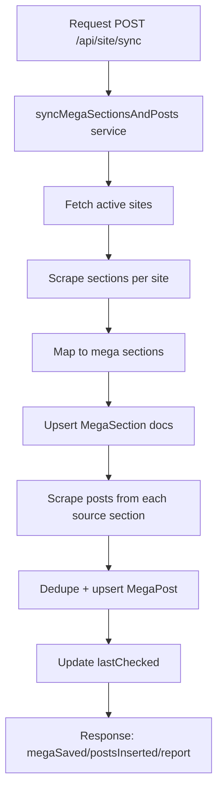

# Aggregator Controller Flow

Controller file: `src/controllers/aggregator.controller.mjs`
Route file: `src/routes/aggregator.routes.mjs`
Mounted as: `/api/site/*`

## Endpoints
- `POST /api/site/site` -> `addSite`
- `GET /api/site/sites` -> `getSites`
- `PUT /api/site/site/:id/status` -> `updateStatus`
- `POST /api/site/sync` -> `runMegaSync`
- `GET /api/site/mega-sections` -> `getMegaSections`
- `GET /api/site/mega-posts?slug=&page=&limit=` -> `getMegaPosts`

## Flow (sync)

## What It Does
- Maintains list of source sites and their active/inactive status.
- Builds normalized mega sections.
- Syncs section posts into `MegaPost` with dedupe keys.
- Provides paginated read API for mega posts.
