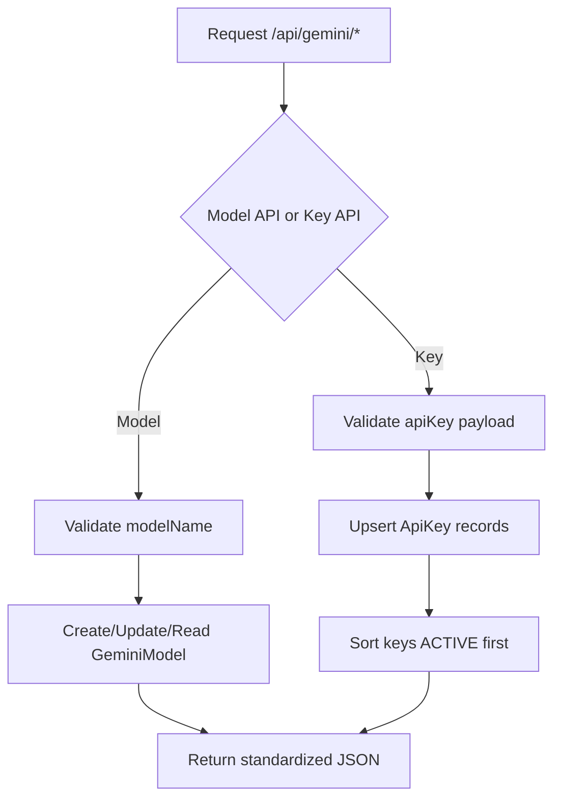

# Gemini Controller Flow

Controller file: `src/controllers/gemini.controller.mjs`
Route file: `src/routes/gemini.routes.mjs`
Mounted as: `/api/gemini/*`

## Endpoints
- `GET /api/gemini/models` -> `getModel`
- `POST /api/gemini/models` -> `setModel`
- `PATCH /api/gemini/models/status` -> `changeStatus`
- `GET /api/gemini/keys` -> `getApiKey`
- `POST /api/gemini/keys` -> `setApiKey`
- `POST /api/gemini/keys/bulk` -> `setApiKeysBulk`

## Flow

## What It Does
- Manages Gemini model registry (status + priority).
- Manages Gemini API keys with status and priority.
- Bulk key upsert supported.
- Keeps response shape consistent for admin usage.
