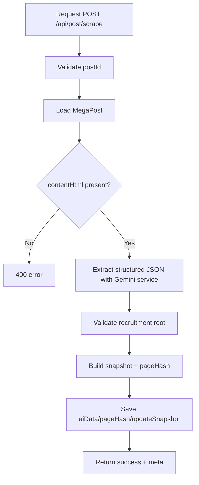

# Post Scrape Controller Flow

Controller file: `src/controllers/postScrape.controller.mjs`
Route file: `src/routes/postScrape.routes.mjs`
Mounted as: `/api/post/*`

## Endpoints
- `POST /api/post/scrape` -> `scrapePost`
- `POST /api/post/update` -> `postUpdate`
- `POST /api/post/track-changes` -> `trackPostChanges` (alias of `postUpdate`)

## Flow: scrapePost


## Flow: postUpdate / track-changes
```mermaid
flowchart TD
A[Request POST /api/post/update] --> B{postId provided?}
B -- Yes --> C[Single updateSinglePostById]
B -- No --> D[Batch runPostUpdateBatch(limit)]
C --> E[Find best matching candidate from section]
D --> E
E --> F[Build snapshot + compare hash]
F --> G{Changed?}
G -- Yes --> H[Update post data + pageHash]
H --> I[Send email notification]
G -- No --> J[Only check metadata update]
I --> K[Return result]
J --> K
```

## What It Does
- `scrapePost`: one-time structured extraction and persistence.
- `postUpdate`: periodic or manual change detection.
- Uses section-level candidate matching + hash diff.
- Sends email when actual tracked fields change.
