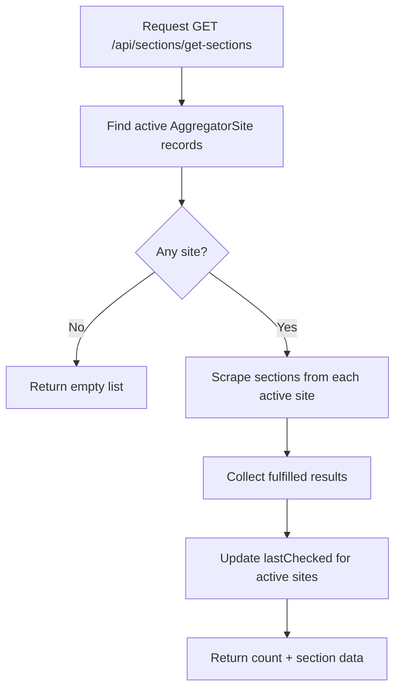

# Section Controller Flow

Controller file: `src/controllers/section.controller.mjs`
Route file: `src/routes/sections.routes.mjs`
Mounted as: `/api/sections/*`

## Endpoint
- `GET /api/sections/get-sections` -> `getSectionsFromActiveSites`

## Flow

## What It Does
- Aggregates section/menu links from currently active source sites.
- Handles partial scrape failures with `Promise.allSettled`.
- Returns only successful site-section payloads.
