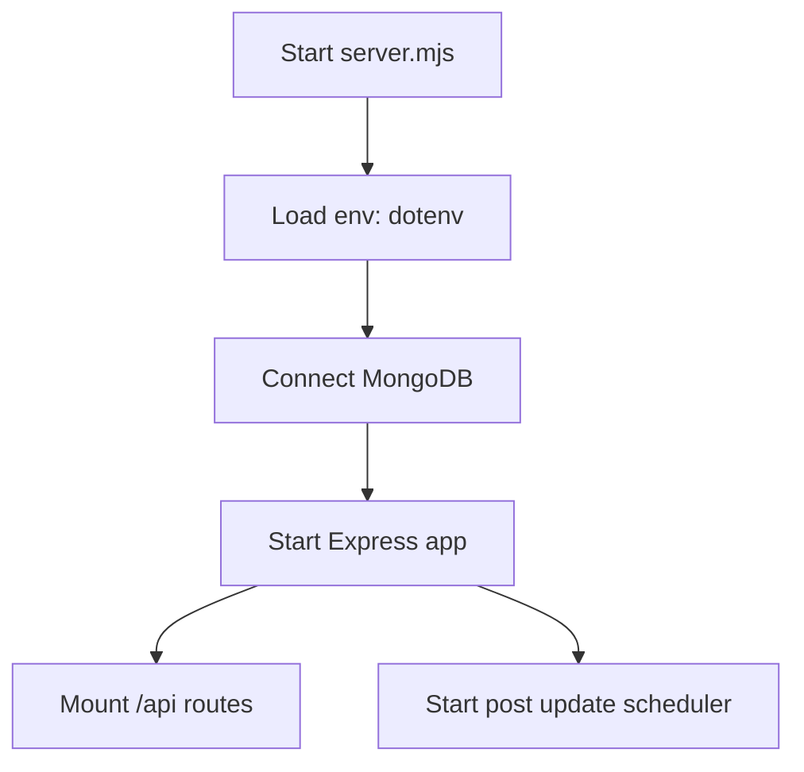
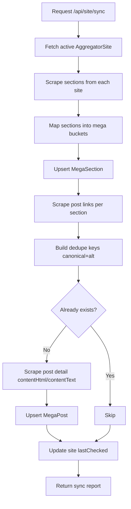
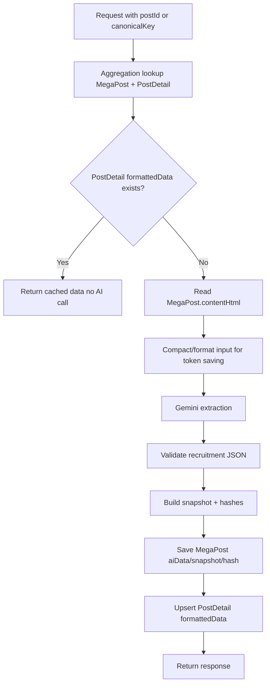
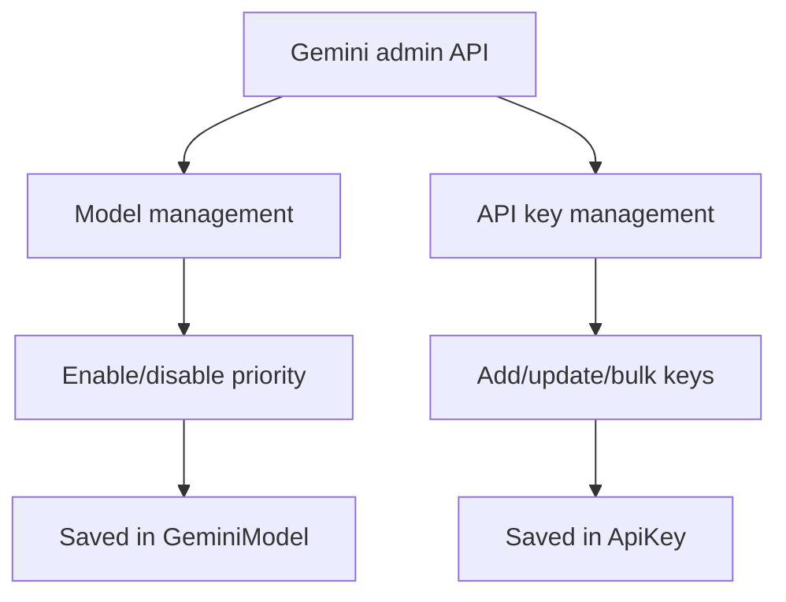

```md
# Codebase Flow Diagram (High-Level)

## 1) Boot Flow


## 2) API Route Map
```mermaid
flowchart TD
A[/api] --> B[/site/*]
A --> C[/sections/*]
A --> D[/post/*]
A --> E[/gemini/*]
```

## 3) Sync Flow (`POST /api/site/sync`)


## 4) Post Detail Extraction (`POST /api/post/scrape`)


## 5) Update/Track Flow (`POST /api/post/update` or `/track-changes`)
```mermaid
flowchart TD
A[Request update single/batch] --> B[Pick post(s)]
B --> C[Scrape section posts candidates]
C --> D[Score candidates seedScore + snapshot hashScore]
D --> E[Pick best match]
E --> F[Scrape matched candidate detail]
F --> G[Compute pageHash + htmlStableHash + textHash + fieldDiff]
G --> H{Any meaningful change?}
H -- Yes --> I[Update MegaPost]
I --> J[Send email notification]
H -- No --> K[Only update check metadata]
J --> L[Return result]
K --> L
```

## 6) Gemini Admin Flow (`/api/gemini/*`)


## 7) Data Stores
- `AggregatorSite`: source websites
- `MegaSection`: normalized buckets + source sections
- `MegaPost`: deduped post list + content + update metadata
- `PostDetail` (`strict: false`): formatted extracted payload cache
- `GeminiModel`: model config
- `ApiKey`: Gemini keys + status/priority/usage
```


Sabse pehle codebase ka **overall flow** ye hai:

1. Server boot
- `server.mjs` start hota hai
- `dotenv` load, DB connect
- Express app run hoti hai
- post update scheduler (cron) start hota hai

2. App routing
- `src/app.mjs` me `/api` prefix ke andar routes mount hain
- Main route groups:
  - `/api/site/*` (aggregator + sync)
  - `/api/sections/*` (sections scrape)
  - `/api/post/*` (post scrape/update)
  - `/api/gemini/*` (model/key management)

3. Source ingestion flow (`/api/site/sync`)
- Active sites (`AggregatorSite`) uthte hain
- Har site ke sections scrape hote hain
- Sections ko mega buckets me map kiya jata hai (`MegaSection`)
- Har source section se post links scrape hote hain
- Dedupe key (`canonicalKey`, alt keys) ban kar `MegaPost` upsert hota hai
- Ab sync me `contentHtml/contentText` bhi store hota hai

4. Detail extraction flow (`/api/post/scrape`)
- Input: `postId` ya `canonicalKey`
- Aggregation pipeline se `MegaPost + PostDetail` lookup
- Agar `PostDetail` already hai -> direct cached return (AI call skip)
- Nahi hai -> `MegaPost.contentHtml` ko compact format karke Gemini extraction
- Output save:
  - `MegaPost` (aiData, snapshot, hashes)
  - `PostDetail` (strict false, formattedData + hashes)

5. Update tracking flow (`/api/post/update` or `/track-changes`)
- Section se candidate posts re-scrape
- Best match scoring:
  - seed score (title + dedupe signals)
  - snapshot hash score
- Change detection:
  - `pageHash`
  - `htmlStableHash`
  - `textHash`
  - field diff
- Change mile to `MegaPost` update + email notify

6. Gemini admin flow (`/api/gemini/*`)
- Gemini models enable/priority manage
- API keys add/bulk/status manage
- Extraction service yahi config use karta hai

Agar chaho next message me main isko **diagram format** (step-by-step blocks) me de deta hoon jo doc me directly paste ho jaye.